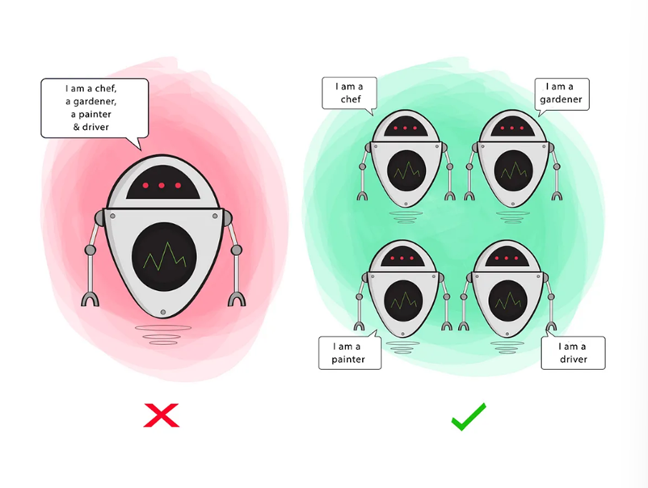
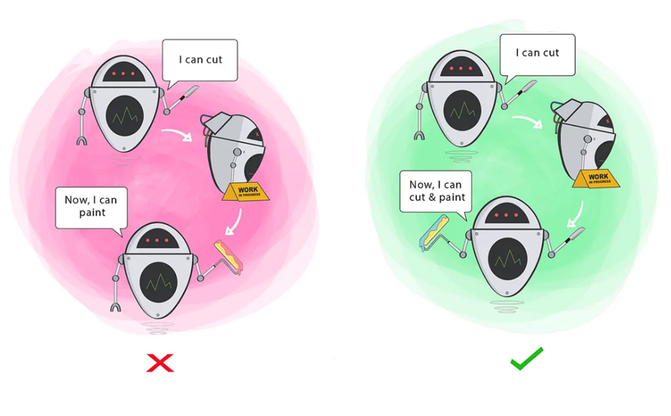
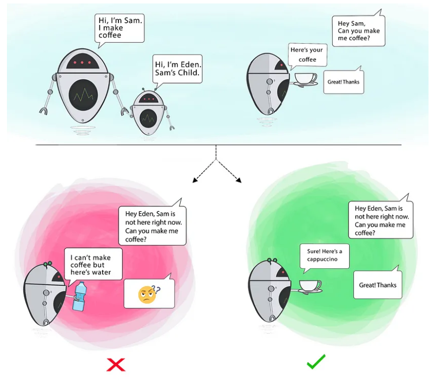
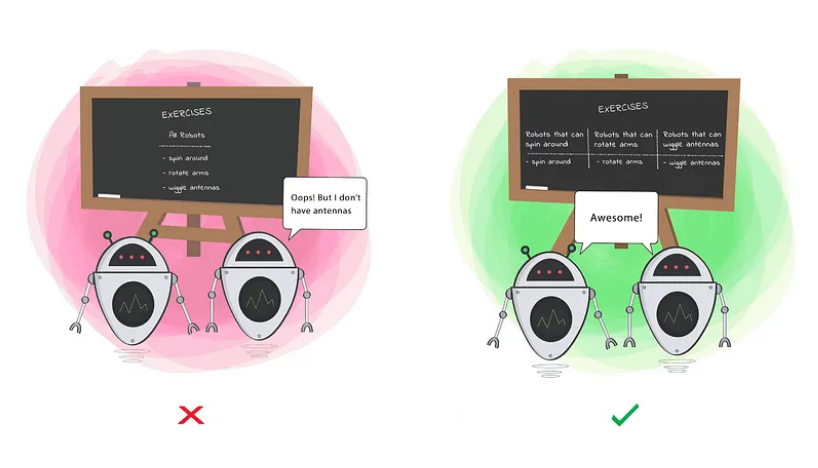
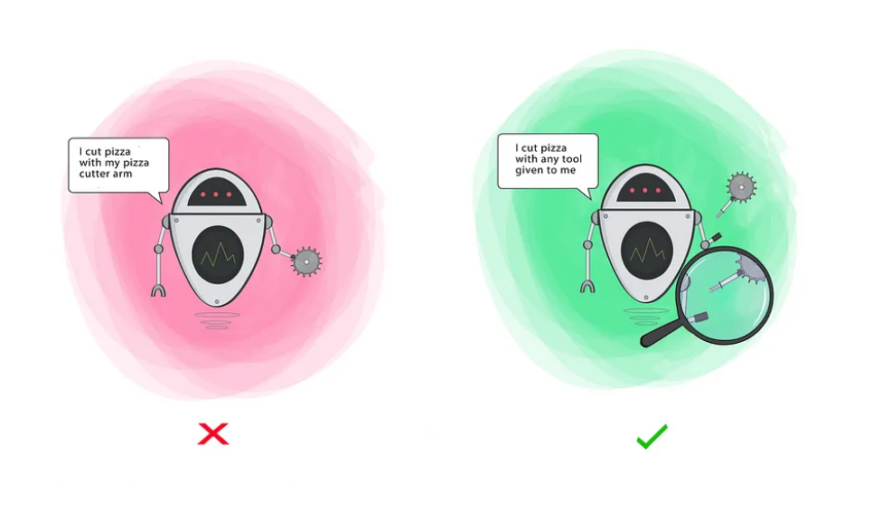

# 📚 SOLID Principles in Dart

The **SOLID** principles are a set of five design principles intended to make object-oriented software more understandable, flexible, and maintainable. These principles were introduced by **Robert C. Martin** (Uncle Bob).

**SOLID** is an acronym for:

* **S** – Single Responsibility Principle
* **O** – Open/Closed Principle
* **L** – Liskov Substitution Principle
* **I** – Interface Segregation Principle
* **D** – Dependency Inversion Principle

---

## ✅ 1. Single Responsibility Principle (SRP)



**Definition**: A class should have only one reason to change, meaning it should only have one job or responsibility.

### ❌ Bad Example

```dart
class UserManager {
  void createUser(String name) {
    // Logic to create user
  }

  void sendEmail(String email) {
    // Logic to send email
  }
}
```

> This class is handling **both** user creation and email sending — two different responsibilities.

### ✅ Good Example

```dart
class UserCreator {
  void createUser(String name) {
    // Logic to create user
  }
}

class EmailSender {
  void sendEmail(String email) {
    // Logic to send email
  }
}
```

> Now, each class has **one responsibility**, making them easier to manage and test.

---

## ✅ 2. Open/Closed Principle (OCP)



**Definition**: Software entities should be open for **extension** but closed for **modification**.

### ❌ Bad Example

```dart
class DiscountCalculator {
  double calculate(String type, double amount) {
    if (type == "seasonal") {
      return amount * 0.9;
    } else if (type == "clearance") {
      return amount * 0.5;
    }
    return amount;
  }
}
```

> Adding a new discount type requires modifying this class.

### ✅ Good Example

```dart
abstract class DiscountStrategy {
  double applyDiscount(double amount);
}

class SeasonalDiscount implements DiscountStrategy {
  @override
  double applyDiscount(double amount) => amount * 0.9;
}

class ClearanceDiscount implements DiscountStrategy {
  @override
  double applyDiscount(double amount) => amount * 0.5;
}

class DiscountCalculator {
  double calculate(DiscountStrategy strategy, double amount) {
    return strategy.applyDiscount(amount);
  }
}
```

> Now, to add a new discount type, just **extend** `DiscountStrategy`.

---

## ✅ 3. Liskov Substitution Principle (LSP)



**Definition**: Objects of a superclass should be replaceable with objects of its subclasses without breaking the application.

### ❌ Bad Example

```dart
class Bird {
  void fly() {
    print("Flying");
  }
}

class Ostrich extends Bird {
  @override
  void fly() {
    throw Exception("Ostrich can't fly!");
  }
}
```

> An `Ostrich` is a `Bird`, but it can't fly — this breaks substitution.

### ✅ Good Example

```dart
abstract class Bird {}

abstract class FlyingBird extends Bird {
  void fly();
}

class Sparrow extends FlyingBird {
  @override
  void fly() => print("Sparrow flying");
}

class Ostrich extends Bird {
  void walk() => print("Ostrich walking");
}
```

> Now, you won’t mistakenly call `fly()` on a non-flying bird.

---

## ✅ 4. Interface Segregation Principle (ISP)



**Definition**: No client should be forced to depend on methods it does not use.

### ❌ Bad Example

```dart
abstract class Worker {
  void work();
  void eat();
}

class Robot implements Worker {
  @override
  void work() => print("Robot working");

  @override
  void eat() {
    throw Exception("Robot doesn't eat");
  }
}
```

> `Robot` is forced to implement `eat()` which it doesn't need.

### ✅ Good Example

```dart
abstract class Workable {
  void work();
}

abstract class Eatable {
  void eat();
}

class Human implements Workable, Eatable {
  @override
  void work() => print("Human working");

  @override
  void eat() => print("Human eating");
}

class Robot implements Workable {
  @override
  void work() => print("Robot working");
}
```

> Now, classes implement **only what they need**.

---

## ✅ 5. Dependency Inversion Principle (DIP)



**Definition**: High-level modules should not depend on low-level modules. Both should depend on abstractions.

### ❌ Bad Example

```dart
class MySQLDatabase {
  void save(String data) {
    print("Saving $data to MySQL");
  }
}

class DataManager {
  final MySQLDatabase database = MySQLDatabase();

  void saveData(String data) {
    database.save(data);
  }
}
```

> `DataManager` is tightly coupled to `MySQLDatabase`.

### ✅ Good Example

```dart
abstract class Database {
  void save(String data);
}

class MySQLDatabase implements Database {
  @override
  void save(String data) {
    print("Saving $data to MySQL");
  }
}

class DataManager {
  final Database database;

  DataManager(this.database);

  void saveData(String data) {
    database.save(data);
  }
}
```

> Now `DataManager` depends on an **abstraction**, not a concrete implementation.

---

# 🎯 Summary

| Principle | Description                                  |
| --------- | -------------------------------------------- |
| **SRP**   | One class = one responsibility               |
| **OCP**   | Extend classes, don't modify them            |
| **LSP**   | Subtypes should substitute base types        |
| **ISP**   | Keep interfaces small and specific           |
| **DIP**   | Depend on abstractions, not concrete classes |
